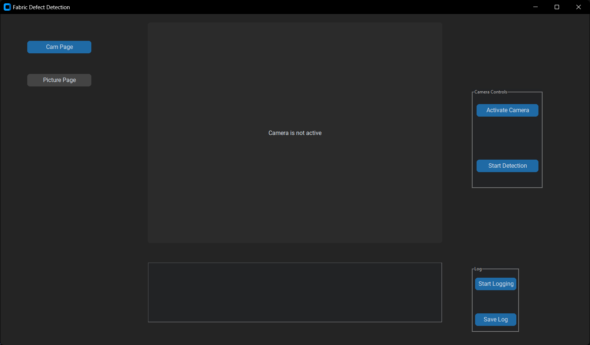
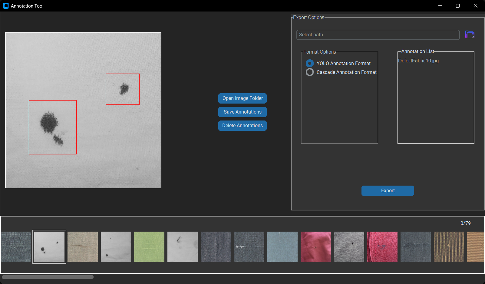

# Fabric Defect Detection Tool

An intuitive tool designed to detect fabric defects using a Cascade Classifier. With a user-friendly interface and customizable annotation tool, it empowers quality control in textile manufacturing by identifying common fabric defects in real-time.

## Features

- **Real-time Fabric Defect Detection**: Utilize your camera to instantly identify fabric defects using computer vision.
- **User-friendly Interface**: Powered by `customtkinter`, the tool offers a seamless experience with no command-line hassle.
- **Custom Annotation Tool**: Built-in tool to help users create annotations in specific formats for training purposes.

## Table of Contents

1. [Installation](#installation)
2. [Usage](#usage)
3. [Annotation Tool](#annotation-tool)
4. [Training Process](#training-process)
5. [Results](#results)
6. [Dataset](#dataset)
7. [Contributing](#contributing)

## Installation

### Dependencies

Ensure you have the following installed:
- [OpenCV](https://opencv.org/)
- [CustomTkinter](https://github.com/TomSchimansky/CustomTkinter)

```bash
pip install opencv-python-headless customtkinter
```

## Usage

Running the tool is simple thanks to its clear and interactive user interface. Follow these steps:

1. Clone the repository.
2. Run the `InspectionTool.py` file:
   ```bash
   python InspectionTool.py
   ```
3. The interface will guide you through the defect detection process, leveraging your camera for real-time analysis. No need for command-line arguments—the UI is self-explanatory and structured for ease of use.



## Annotation Tool

For those looking to create their own training data, the `AnnotTool.py` is designed to help you generate annotations in the required format.

- **Supported Formats**: YOLO format is fully supported, while the Cascade format is currently a work in progress (WIP).
- **How to Use**: Simply run the `AnnotTool.py` file and follow the on-screen instructions to annotate your images with ease.



```bash
python AnnotTool.py
```

## Training Process

The training process for the Cascade Classifier will be provided soon. Stay tuned for detailed instructions on how to train the model using your own dataset.

## Results

Once defects are detected, the tool highlights them directly on the camera feed. No complex outputs—just an easy-to-interpret visual representation of the detected defects in real-time.

## Dataset

The dataset used to train the model was created manually using Photoshop and contains common fabric defects.

> **Note**: If you need access to the dataset, please send an email to [yusuf.borak@outlook.com.tr](mailto:yusuf.borak@outlook.com.tr).

## Contributing

Contributions are welcome! If you would like to improve this project, feel free to open a pull request or suggest features and bug fixes by raising an issue.

### How to Contribute:
1. Fork the repository.
2. Create a new branch (`git checkout -b feature/YourFeature`).
3. Commit your changes (`git commit -m 'Add your feature'`).
4. Push to the branch (`git push origin feature/YourFeature`).
5. Open a Pull Request.

Make sure to check out the issues and help improve the project!

## License

This project is licensed under the MIT License. You are free to:

- **Use**: You can use this software for personal, educational, or commercial purposes.
- **Modify**: You are allowed to modify and adapt the code to your needs.
- **Distribute**: You can distribute the original or modified versions of this software.
- **Sublicense**: You can include this software in larger works and sublicense it under your own terms.
- **Contribute**: Contributions to improve this software are welcome!

However, the following conditions must be met:

- **Attribution**: You must give appropriate credit to the original author. Include the following credit notice in any distributed copies:
Copyright © 2024 Yusuf Borak

- **No Warranty**: This software is provided "as-is" without any warranty of any kind. The author is not liable for any damages resulting from the use of this software.

Full terms of the MIT License can be found in the [LICENSE](LICENSE) file.
